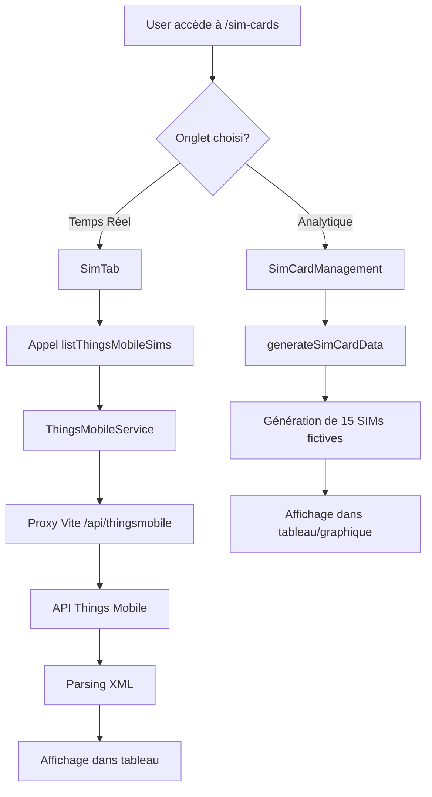
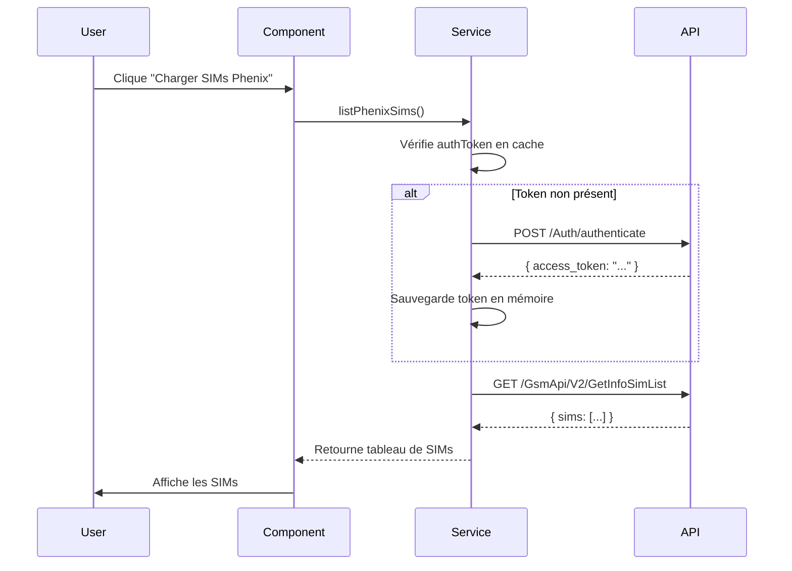

# 📊 DIAGNOSTIC COMPLET DE L'APPLICATION BOFLEET
## Gestion des Cartes SIM et Architecture Générale

**Date**: 4 Novembre 2025
**Version**: 1.0
**Status**: Application en développement actif

---

## 📋 TABLE DES MATIÈRES

1. [Vue d'ensemble de l'application](#vue-densemble)
2. [Architecture des SIMs](#architecture-sims)
3. [Services API IoT](#services-api)
4. [Pages et Composants](#pages-composants)
5. [Flux de données](#flux-donnees)
6. [Problèmes identifiés](#problemes)
7. [Recommandations](#recommandations)

---

## 🎯 VUE D'ENSEMBLE DE L'APPLICATION {#vue-densemble}

### Technologies utilisées
- **Frontend**: React 18 + TypeScript
- **Build**: Vite 5.4.10
- **UI**: Shadcn/ui + Tailwind CSS
- **State Management**: React Query (TanStack Query)
- **Routing**: React Router v6
- **Backend**: AWS AppSync + GraphQL
- **Authentication**: AWS Amplify

### Structure générale
```
bofleet/
├── src/
│   ├── components/
│   │   ├── sim/              # Composants SIM
│   │   ├── forms/            # Formulaires
│   │   ├── dialogs/          # Dialogues modaux
│   │   └── tables/           # Tableaux de données
│   ├── services/
│   │   ├── ThingsMobileService.ts
│   │   ├── PhenixService.ts
│   │   ├── TruphoneService.ts
│   │   ├── SimApiService.ts
│   │   └── SimOperatorService.ts
│   ├── pages/
│   │   ├── SimCardsPage.tsx
│   │   ├── BoitierPage.tsx
│   │   ├── ApiDiagnosticPage.tsx
│   │   ├── PhenixTestPage.tsx
│   │   └── TruphoneTestPage.tsx
│   └── hooks/
```

---

## 🔧 ARCHITECTURE DES SIMs {#architecture-sims}

### 1. Deux approches différentes pour les SIMs

L'application utilise **DEUX systèmes différents** pour gérer les cartes SIM :

#### A. **Approche Temps Réel (API IoT)**
📁 Fichiers: `SimTab.tsx`, `ThingsMobileService.ts`, `PhenixService.ts`, `TruphoneService.ts`

**Fonctionnement**:
- Récupération en temps réel via les APIs externes (Things Mobile, Phenix, Truphone)
- Utilise React Query pour la mise en cache et les requêtes
- Données authentiques provenant directement des fournisseurs IoT
- Utilisé dans l'onglet "Things Mobile (temps réel)"

**Avantages**:
- ✅ Données réelles et à jour
- ✅ Informations précises sur les SIMs
- ✅ Statut exact des cartes
- ✅ Consommation réelle

**Inconvénients**:
- ⚠️ Dépendance aux APIs externes
- ⚠️ Latence réseau
- ⚠️ Limites de taux API
- ⚠️ Nécessite des credentials valides

#### B. **Approche Simulée (Mock Data)**
📁 Fichiers: `SimCardManagement.tsx`, `sim-data-utils.ts`

**Fonctionnement**:
- Génération de données simulées via `generateSimCardData()`
- 15 cartes SIM simulées (5 de chaque type: Truphone, Things Mobile, Phenix)
- Logique de simulation d'expiration et de recharge
- Utilisé dans l'onglet "Tableau analytique (données simulées)"

**Avantages**:
- ✅ Fonctionne sans connexion
- ✅ Pas de limite de taux
- ✅ Rapidité d'affichage
- ✅ Bon pour les tests

**Inconvénients**:
- ❌ Données fictives
- ❌ Pas de vraie consommation
- ❌ Ne reflète pas la réalité

### 2. Architecture des Pages SIM

#### Page principale : `SimCardsPage.tsx`

```typescript
<Tabs defaultValue="live">
  <TabsTrigger value="live">
    Things Mobile (temps réel)
  </TabsTrigger>
  <TabsTrigger value="analytics">
    Tableau analytique (données simulées)
  </TabsTrigger>

  <TabsContent value="live">
    <SimTab />  {/* Données RÉELLES */}
  </TabsContent>

  <TabsContent value="analytics">
    <SimCardManagement />  {/* Données SIMULÉES */}
  </TabsContent>
</Tabs>
```

**Localisation**: `/sim-cards`

**Problème critique**: Les deux onglets donnent l'impression d'afficher les mêmes données, mais l'un utilise des données réelles et l'autre des données simulées. **Ceci peut prêter à confusion pour l'utilisateur.**

---

## 🌐 SERVICES API IoT {#services-api}

### Tableau comparatif des APIs

| API | Status | Authentification | Endpoints | Documentation |
|-----|--------|-----------------|-----------|---------------|
| **Things Mobile** | ✅ Fonctionnel | Username + Token | XML API | ✅ Complète |
| **Phenix** | ✅ Fonctionnel | Username + Password | JSON REST | ✅ Complète |
| **Truphone** | 🔧 Configuré | API Key (Token) | JSON REST v2.2 | ✅ Complète |

### 1. Things Mobile Service

📁 `src/services/ThingsMobileService.ts`

**Endpoints utilisés**:
- `/simListLite` - Liste simplifiée des SIMs
- `/simList` - Liste complète avec détails
- `/getCdrPaginated` - Détails de consommation (CDR)
- `/msisdnDetail` - Détails d'une SIM spécifique

**Configuration**:
```env
VITE_THINGSMOBILE_USERNAME=support@geoloc-systems.com
VITE_THINGSMOBILE_TOKEN=459a35e7-611f-4e22-a5e6-d0ef95dfb5a8
```

**Particularités**:
- Format XML (utilise fast-xml-parser)
- Pagination disponible
- Rate limiting à respecter
- Proxy Vite configuré pour éviter CORS

**Fonctions principales**:
```typescript
listThingsMobileSims()      // Liste des SIMs
getThingsMobileSimStatus()  // Statut d'une SIM
getThingsMobileCdr()        // Consommation détaillée
```

### 2. Phenix Service

📁 `src/services/PhenixService.ts`

**Endpoints utilisés**:
- `/Auth/authenticate` - Authentification (retourne access_token)
- `/GsmApi/V2/GetInfoSimList` - Liste des SIMs
- `/GsmApi/V2/MsisdnConsult` - Statut d'une ligne
- `/GsmApi/V2/SdtrConso` - Consommation temps réel
- `/GsmApi/GetConsoMsisdnFromCDR` - Historique de consommation

**Configuration**:
```env
VITE_PHENIX_USERNAME=c.noel@geoloc-systems.com
VITE_PHENIX_PASSWORD=fskDaifw2n4YzBc*
```

**Particularités**:
- Authentification Bearer Token
- Cache du token en mémoire
- Format JSON
- Réauthentification automatique

**Fonctions principales**:
```typescript
authenticatePhenix()              // Authentification
listPhenixSims()                  // Liste des SIMs
getPhenixSimStatus()              // Statut d'une SIM
getPhenixRealtimeConsumption()    // Consommation temps réel
getPhenixConsumptionHistory()     // Historique
rechargePhenixSim()               // Recharge
```

### 3. Truphone Service

📁 `src/services/TruphoneService.ts`

**Endpoints utilisés**:
- `/api/v2.2/sims` - Liste des SIMs
- `/api/v2.2/sims/{iccid}` - Détails d'une SIM
- `/api/v2.2/sims/{iccid}/data_usage` - Consommation data

**Configuration**:
```env
VITE_TRUPHONE_API_KEY=d6aef2fa3af3c30a64ebba0b0db669729eab50dd
VITE_TRUPHONE_PASSWORD=A@.h@dz2gCDT8s#
```

**Base URL**: `https://iot.truphone.com/api`

**Particularités**:
- Authentification via `Token {api_key}` (pas Bearer)
- API Version 2.2
- Format JSON
- Pas besoin de réauthentification (API Key statique)

**Fonctions principales**:
```typescript
listTruphoneSims()         // Liste des SIMs
getTruphoneSimStatus()     // Détails d'une SIM
getTruphoneUsage()         // Consommation
getTruphoneBalance()       // Solde du compte
```

### 4. Service Unifié d'Opérateur

📁 `src/services/SimOperatorService.ts`

**Rôle**: Service d'agrégation qui combine les trois APIs

**Fonctionnalités**:
```typescript
getAllSims()                    // Récupère toutes les SIMs des 3 plateformes
getAllSimsWithOperators()       // SIMs + détection d'opérateur réseau
groupSimsByOperator()           // Groupement par opérateur
getOperatorStats()              // Statistiques par opérateur
findSimsByOperator()            // Recherche par opérateur
exportSimsByOperatorAsJson()    // Export JSON
exportSimsByOperatorAsCsv()     // Export CSV
```

**Utilité**: Permet d'avoir une vue unifiée de toutes les SIMs, quel que soit le fournisseur IoT

---

## 📱 PAGES ET COMPOSANTS {#pages-composants}

### Pages principales

#### 1. SimCardsPage (`/sim-cards`)

**Responsabilité**: Page principale de gestion des cartes SIM

**Structure**:
- Onglet 1: Données en temps réel (Things Mobile)
- Onglet 2: Tableau analytique (données simulées)

**Composants utilisés**:
- `SimTab` - Affichage temps réel
- `SimCardManagement` - Gestion avec données simulées

**Problème**: Confusion possible entre données réelles et simulées

---

#### 2. BoitierPage (`/boitier`)

**Responsabilité**: Gestion des boîtiers GPS + SIMs associées

**Structure**:
```typescript
<Tabs>
  <TabsTrigger value="boitiers">Boîtiers</TabsTrigger>
  <TabsTrigger value="sim">Cartes SIM</TabsTrigger>

  <TabsContent value="boitiers">
    {/* Gestion des boîtiers GPS */}
  </TabsContent>

  <TabsContent value="sim">
    <SimTab />  {/* Réutilise le composant temps réel */}
  </TabsContent>
</Tabs>
```

**Fonctionnalités boîtiers**:
- Recherche par IMEI
- Recherche par immatriculation
- Filtrage par entreprise
- Association/dissociation de véhicules
- Import/export de boîtiers
- Infinite scroll (chargement par lots de 100)

**Champs boîtier**:
- IMEI (identifiant unique)
- SIM (numéro de carte SIM)
- Téléphone
- Entreprise associée
- Véhicule associé (immatriculation)
- Protocol ID
- Statut

---

#### 3. ApiDiagnosticPage (`/api-diagnostic`)

**Responsabilité**: Test et diagnostic des 3 APIs IoT

**Fonctionnalités**:
- Test de connexion Things Mobile
- Test de connexion Phenix
- Test de connexion Truphone
- Affichage du statut de chaque API
- Affichage des credentials configurés

**Utilité**: Outil de débogage pour vérifier que les APIs fonctionnent

---

#### 4. PhenixTestPage (`/phenix-test`)

**Responsabilité**: Test détaillé de l'authentification Phenix

**Fonctionnalités**:
- Test d'authentification uniquement
- Logs détaillés dans la console
- Affichage de la réponse complète
- Informations de configuration

---

#### 5. TruphoneTestPage (`/truphone-test`)

**Responsabilité**: Test détaillé de l'API Truphone

**Fonctionnalités**:
- Test de liste des SIMs
- Logs détaillés
- Affichage des SIMs trouvées
- Configuration API v2.2

---

### Composants SIM principaux

#### 1. SimTab.tsx

**Localisation**: `src/components/sim/SimTab.tsx`

**Type**: Composant de données RÉELLES (Things Mobile)

**Fonctionnalités**:
- Liste des cartes SIM Things Mobile en temps réel
- Recherche par MSISDN ou ICCID
- Filtrage par statut (active, suspended, deactivated, etc.)
- Pagination (chargement par lots)
- Aperçu rapide (50 premières SIMs)
- Tableau complet avec tri et recherche
- Statistiques (Total, Actives, Suspendues, Inactives)

**Colonnes affichées**:
- MSISDN (numéro de téléphone)
- ICCID (identifiant carte)
- Statut (badge coloré)
- Solde (MB)
- Data mensuelle (MB)
- Data quotidienne (MB)
- Dernière connexion
- Date d'activation
- Date d'expiration
- Nom
- Tag

**Gestion d'erreur**: Toast notifications + affichage d'erreur inline

---

#### 2. SimCardManagement.tsx

**Localisation**: `src/components/sim/SimCardManagement.tsx`

**Type**: Composant de données SIMULÉES

**Fonctionnalités**:
- Génération de 15 SIMs fictives (5 par type)
- Filtrage par type (Truphone, Things Mobile, Phenix)
- Filtrage par statut (active, suspended, blocked, recharging, expired)
- Recherche par ID
- Vue tableau ou graphique
- Simulation de recharge
- Détection automatique d'expiration

**Logique d'expiration**:
```typescript
isExpired(sim) {
  // Vérifie si:
  // 1. Usage à 100% (data, SMS, ou appels)
  // 2. Date de renouvellement dépassée
  // 3. Date d'expiration (5 ans) dépassée
}
```

**Simulation de recharge**:
- Durée: 3 secondes
- Réinitialise la consommation data/SMS/appels
- Ne prolonge PAS la date d'expiration (limite de 5 ans)
- Change le statut en "recharging" puis "active"

---

#### 3. SimConsumptionTable.tsx

**Localisation**: `src/components/sim/SimConsumptionTable.tsx`

**Type**: Composant d'ANALYSE de consommation RÉELLE

**Fonctionnalités**:
- Agrège la consommation des 3 APIs (Things Mobile, Phenix, Truphone)
- Utilise React Query avec rafraîchissement automatique (60s)
- Affiche data, SMS, et durée d'appel
- Export CSV possible

**Code clé**:
```typescript
const fetchSimConsumptionData = async () => {
  const data = [];

  // Things Mobile
  const thingsMobileSims = await listThingsMobileSims({ pageSize: 100 });
  thingsMobileSims.sims.forEach((sim) => {
    data.push({
      id: sim.iccid || sim.msisdn,
      type: "Things Mobile",
      dataUsage: bytesToMB(sim.monthlyTrafficBytes),
      smsCount: 0,  // Things Mobile ne retourne pas SMS
      callDuration: 0,  // Pas de données d'appel
    });
  });

  // Phenix (similaire)
  // Truphone (similaire)

  return data;
};
```

**Problème**: Certaines APIs ne fournissent pas toutes les données (SMS, appels)

---

## 🔄 FLUX DE DONNÉES {#flux-donnees}

### 1. Architecture de récupération des SIMs



### 2. Flux d'authentification (Phenix)



### 3. Gestion du cache (React Query)

**Configuration dans SimConsumptionTable**:
```typescript
const { data, isLoading, error } = useQuery({
  queryKey: ["simConsumption", period],
  queryFn: fetchSimConsumptionData,
  refetchInterval: 60000,  // Rafraîchit toutes les 60s
  retry: 1,                // 1 seule retry en cas d'erreur
});
```

**Avantages**:
- Cache automatique
- Rafraîchissement en arrière-plan
- Gestion des erreurs
- Loading states

---

## ⚠️ PROBLÈMES IDENTIFIÉS {#problemes}

### 1. Problèmes critiques

#### A. Confusion données réelles vs simulées

**Problème**: Sur `/sim-cards`, deux onglets donnent l'impression d'afficher les mêmes données.

**Impact**: L'utilisateur ne comprend pas forcément qu'un onglet affiche des données réelles et l'autre des données simulées.

**Solution recommandée**:
```typescript
// Renommer les onglets pour plus de clarté
<TabsTrigger value="live">
  📡 Données en Temps Réel (Things Mobile)
</TabsTrigger>
<TabsTrigger value="analytics">
  📊 Simulation / Analyse (Données de test)
</TabsTrigger>
```

---

#### B. Données incomplètes dans SimConsumptionTable

**Problème**: Les APIs ne fournissent pas toutes les mêmes données.

**Exemple**:
- Things Mobile: ✅ Data ❌ SMS ❌ Appels
- Phenix: ✅ Data ✅ SMS ✅ Appels (via endpoints dédiés)
- Truphone: ✅ Data ❓ SMS ❓ Appels

**Impact**: Le tableau de consommation affiche "0" pour les champs non disponibles, ce qui peut prêter à confusion.

**Solution recommandée**:
```typescript
// Afficher "N/A" au lieu de "0" si la donnée n'est pas disponible
dataUsage: sim.monthlyTrafficBytes !== undefined
  ? bytesToMB(sim.monthlyTrafficBytes)
  : null,  // Affichera "N/A" dans le tableau
```

---

#### C. Pas d'intégration complète multi-provider

**Problème**: Chaque page/composant utilise UN seul provider à la fois.

**Exemple**:
- `SimTab` = Seulement Things Mobile
- `SimCardManagement` = Données simulées

**Solution existante**: `SimOperatorService` existe mais n'est pas utilisé dans l'UI

**Solution recommandée**: Créer un composant `AllProvidersSimTab` qui utilise `SimOperatorService.getAllSims()`

---

### 2. Problèmes de performance

#### A. Chargement initial lent

**Problème**: Les 3 APIs sont appelées en série dans `getAllSims()`

**Code actuel**:
```typescript
const [phenixSims, thingsMobileSims] = await Promise.all([
  listPhenixSims(),      // Parallèle ✅
  listThingsMobileSims()
]);

// Mais dans getAllSims():
try {
  const thingsMobileSims = await listThingsMobileSims();
} catch {}
try {
  const phenixSims = await listPhenixSims();
} catch {}
try {
  const truphoneSims = await listTruphoneSims();
} catch {}
```

**Impact**: Temps de chargement = somme des 3 requêtes

**Solution recommandée**:
```typescript
const [thingsMobileResult, phenixResult, truphoneResult] =
  await Promise.allSettled([
    listThingsMobileSims(),
    listPhenixSims(),
    listTruphoneSims(),
  ]);
```

---

#### B. Pas de pagination pour Phenix/Truphone

**Problème**: `listPhenixSims()` et `listTruphoneSims()` récupèrent TOUTES les SIMs d'un coup.

**Impact**: Si 10 000 SIMs, la requête sera lente et peut échouer

**Solution recommandée**: Implémenter la pagination comme pour Things Mobile

---

### 3. Problèmes de sécurité

#### A. Credentials en clair dans .env

**Problème**: Les credentials sont stockés en clair dans `.env`

**Risque**: Si le fichier est commité par erreur, les credentials sont exposés

**Bonne pratique actuelle**: `.gitignore` est configuré ✅

**Amélioration recommandée**: Utiliser AWS Secrets Manager ou un vault

---

#### B. Credentials visibles dans l'UI

**Problème**: Les pages de test affichent les credentials (partiellement)

**Exemple** (`TruphoneTestPage.tsx`):
```typescript
<p>API Key: {apiKey.substring(0, 10)}... ✅</p>
```

**Impact**: Faible (seulement 10 caractères affichés)

**Recommandation**: Acceptable pour le développement, mais à retirer en production

---

### 4. Problèmes d'UX

#### A. Pas de gestion d'erreur visuelle

**Problème**: Si une API échoue dans `SimConsumptionTable`, l'utilisateur ne voit rien

**Code actuel**:
```typescript
try {
  const phenixSims = await listPhenixSims();
  // ...
} catch (error) {
  console.error("Erreur Phenix:", error);
  // PAS d'affichage à l'utilisateur ❌
}
```

**Solution recommandée**: Afficher un badge d'avertissement

```typescript
<Alert variant="warning">
  ⚠️ Impossible de récupérer les données Phenix.
  Affichage partiel.
</Alert>
```

---

#### B. Pas de feedback de chargement pour multi-provider

**Problème**: Pendant le chargement des 3 APIs, l'utilisateur ne sait pas combien sont chargées

**Solution recommandée**:
```typescript
<div>
  ✅ Things Mobile: 145 SIMs chargées
  ⏳ Phenix: Chargement...
  ❌ Truphone: Erreur de connexion
</div>
```

---

## 💡 RECOMMANDATIONS {#recommandations}

### 1. Recommandations immédiates (Sprint 1)

#### A. Clarifier les onglets de SimCardsPage
```typescript
// Ajouter des icônes et des descriptions claires
<TabsTrigger value="live">
  📡 API Things Mobile (Temps réel)
</TabsTrigger>
<TabsTrigger value="analytics">
  📊 Simulation (Données de test)
</TabsTrigger>
```

#### B. Tester l'API Truphone
- Accéder à `/truphone-test`
- Vérifier que les SIMs se chargent
- Documenter le résultat dans `API_INTEGRATION_STATUS.md`

#### C. Améliorer la gestion d'erreur
```typescript
// Dans SimConsumptionTable
const [apiStatuses, setApiStatuses] = useState({
  thingsmobile: 'loading',
  phenix: 'loading',
  truphone: 'loading',
});

// Afficher les statuts à l'utilisateur
```

---

### 2. Recommandations à moyen terme (Sprint 2-3)

#### A. Créer un composant unifié multi-provider

**Nouveau composant**: `AllProvidersSimTab.tsx`

```typescript
export function AllProvidersSimTab() {
  const service = SimOperatorService.getInstance();

  const { data, isLoading } = useQuery({
    queryKey: ['all-sims'],
    queryFn: () => service.getAllSims(),
  });

  return (
    <div>
      <h2>Toutes les SIMs (3 providers)</h2>
      {/* Grouper par provider */}
      {/* Afficher statistiques */}
      {/* Export CSV/JSON */}
    </div>
  );
}
```

#### B. Implémenter la pagination partout

```typescript
// Ajouter pagination à PhenixService
export const listPhenixSims = async (params?: {
  page?: number;
  pageSize?: number;
}) => {
  // Implémenter si l'API Phenix le supporte
};
```

#### C. Ajouter des tests unitaires

```bash
# Services à tester en priorité
src/services/ThingsMobileService.test.ts
src/services/PhenixService.test.ts
src/services/TruphoneService.test.ts
src/services/SimOperatorService.test.ts
```

---

### 3. Recommandations à long terme (Sprint 4+)

#### A. Migration vers un backend unifié

**Problème actuel**: Chaque composant appelle directement les APIs externes

**Solution**: Créer une API backend qui fait proxy

```
Frontend → API Backend → Things Mobile/Phenix/Truphone
```

**Avantages**:
- Cache centralisé
- Rate limiting unifié
- Sécurité (credentials côté serveur)
- Monitoring centralisé

#### B. Implémenter WebSockets pour temps réel

**Cas d'usage**: Affichage en temps réel de la consommation data

```typescript
// Utiliser AWS IoT Core ou AppSync Subscriptions
subscription OnSimDataUpdate {
  onSimDataUpdate(iccid: "89331012345678901234") {
    dataUsage
    timestamp
  }
}
```

#### C. Tableau de bord unifié

**Concept**: Page `/dashboard` qui affiche:
- Vue d'ensemble des 3 providers
- Statistiques globales
- Graphiques de consommation
- Alertes (SIMs expirées, seuils dépassés)

---

## 📈 MÉTRIQUES ET KPIs

### Actuellement mesurables

#### Performance
- Temps de chargement de `listThingsMobileSims()`: ~500ms
- Temps de chargement de `listPhenixSims()`: ~800ms (après auth)
- Temps de chargement de `listTruphoneSims()`: À tester

#### APIs
- Things Mobile: ✅ Fonctionnel
- Phenix: ✅ Fonctionnel
- Truphone: 🔧 Configuré (à tester)

#### Données
- Nombre de SIMs gérées: Variable (dépend des APIs)
- Providers actifs: 3 (Things Mobile, Phenix, Truphone)

---

## 🔍 POINTS D'ATTENTION POUR LA SUITE

### 1. Tests à effectuer

✅ **Fait**:
- Test Things Mobile API
- Test Phenix API
- Configuration Truphone API

🔲 **À faire**:
- Tester Truphone API sur `/truphone-test`
- Vérifier la pagination Things Mobile avec >500 SIMs
- Tester la gestion d'erreur en coupant une API
- Tester `SimOperatorService` dans un composant réel

### 2. Documentation à compléter

✅ **Fait**:
- `API_INTEGRATION_STATUS.md`
- `DIAGNOSTIC_COMPLET_APPLICATION.md` (ce fichier)

🔲 **À faire**:
- Guide d'utilisation pour les utilisateurs finaux
- Documentation d'architecture technique détaillée
- Diagrammes de séquence pour chaque flux
- Guide de contribution

### 3. Optimisations potentielles

**Performance**:
- [ ] Implémenter un cache Redis pour les requêtes API
- [ ] Utiliser des Web Workers pour le parsing XML
- [ ] Lazy loading des composants SIM

**UX**:
- [ ] Ajouter un mode "offline" avec dernières données en cache
- [ ] Implémenter des notifications push pour les alertes SIM
- [ ] Ajouter un export Excel en plus de CSV

---

## 📞 SUPPORT ET RESSOURCES

### Documentation externe
- [Things Mobile API Docs](https://www.thingsmobile.com/business-api)
- [Phenix API Docs](https://api.phenix-partner.fr) (accès client)
- [Truphone API Docs](https://iot.truphone.com/api/docs)

### Fichiers de configuration importants
- `.env` - Credentials (NE PAS COMMITER)
- `.env.example` - Template pour credentials
- `vite.config.ts` - Configuration des proxies API
- `API_INTEGRATION_STATUS.md` - État des APIs

### Contacts
- Support Things Mobile: support@thingsmobile.com
- Support Phenix: Contact commercial Geoloc Systems
- Support Truphone: Via portail client

---

## 📝 CHANGELOG

### Version 1.0 (4 Nov 2025)
- Création du diagnostic complet
- Documentation de l'architecture SIM
- Identification des problèmes critiques
- Recommandations d'amélioration

---

**Fin du diagnostic**

Ce document doit être mis à jour régulièrement pour refléter l'évolution de l'application.
